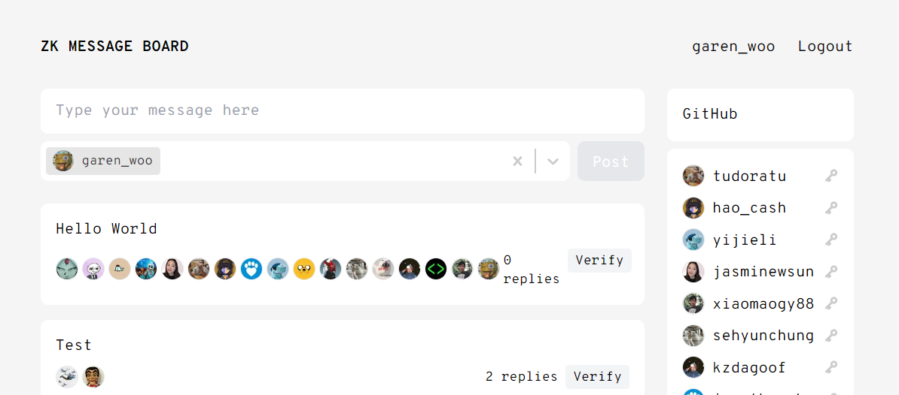

# 第 1 课 课后作业
本次作业来自于：https://zkshanghai.xyz/notes/exercise1.html
## 第 1 题：练习 1
**题目**：目前，您只能选择相邻的节点对进行检查。 如果您可以选择任意节点对来检查，证明仍然是零知识吗？

我的回答：判断是否是零知识，从零知识的定义下手，倘若被保密的信息主动告知或具备破解可行性，则不算零知识。摘取此问题的几个关键点： 
(0) 被保密的信息是确切的涂色方案（即 input）。可被公开的是一张图仅有三种颜色（即 output）。 
(1) 可选择任意节点对进行验证。 
(2) 两个相邻节点的颜色不同。 
(3) 证明者一旦提供选择就不允许改变主意，且允许混合选择之间的颜色（每次验证的着色方案不尽相同）。 

当验证者选择的节点从相邻节点对变为任意选择节点对时： 
a. 选择某一节点A作为起始点，与任何一个未验证颜色关系（与节点A同色或不同色）的节点组成一对，执行验证，记录节点之间的颜色关系（同色/不同色），这个颜色关系即两节点颜色的逻辑。 
b. 选择已验证节点和未验证节点组成一对，执行验证，记录两者的颜色关系。反复执行此步骤，直至所有节点被验证完毕，获得所有节点之间的颜色关系（节点之间颜色的逻辑） 
c. 当所有节点已经被验证，则整张图所有节点的颜色关系（节点之间颜色的逻辑）已确认。如果整张图仅有三个颜色，则所有节点之间的颜色关系必须满足三色问题的约束条件。如果颜色关系不符合三色问题的约束条件，则该图不可能仅有三个颜色。截止此步，证明者已经可以证明“一张图仅有三个颜色”。 
d. 虽然颜色关系可知，但由于没有任何一个节点被揭露具体颜色，故每个节点具体的颜色是无法确定的。节点可选的颜色数量有限且节点颜色可通过“轮转”实现固定数量的方案，存在一定的概率使得验证者蒙对确切的涂色方案（即哪个节点具体涂了什么色），但仍无确切依据进而确定 exact solution, 因此可认为 input 未被泄露。 
   
结论：此时对三色问题的验证依然是零知识。

## 可选 - DLOG 的 ZKP

用离散对数实现非交互零知识证明！ 为此，您需要阅读并理解 [本讲义](https://people.eecs.berkeley.edu/~jfc/cs174/lecs/lec24/lec24.pdf) 的第一部分，因为 以及 [Fiat-Shamir 启发式](https://en.wikipedia.org/wiki/Fiat%E2%80%93Shamir_heuristic)。

具体来说，您应该实施：

- 函数 dlogProof(x, g, p) 返回 (1) 残差 y，计算方法为 g^x (mod p) 和 (2) 可以证明您知道 x 是 y 的离散对数的证据 pf。
- 函数 verify(y, g, p, pf) 如果 pf 是有效的证据，则计算结果为真，否则为假。如果证明者确实知道有效 x，则证明者应该只能以不可忽略的概率计算有效证明。

如果您需要帮助，可以在 [此处](https://github.com/gubsheep/zk-beginner) 找到带有注释的 Javascript 参考实现。 这个练习可能需要你几个小时。

对于额外的挑战，也可以尝试实施非交互式 ZKP 来证明 3 色！

## zkmessage.xyz
在 [zkmessage](https://zkmessage.xyz) 上创建一个帐户并发布消息，这是一个由 zkSNARK 支持的匿名留言板。

- 解释为什么你需要生成并保存一个“秘密值” 。

我的回答：这采用了非对称加密，生成“秘密值”是私钥，私钥本身与实际用户自身隐私信息不产生关联，从而达到匿名的目的。用户控制私钥（秘密值）则可以用这个虚拟的身份在 zkmessage 上活动。私钥可导出公钥，但反之不可。私钥保密，公钥公开；私钥签名，公钥验证，以此不让外界的验证者知道用户私钥是什么，但可以确认的确是这个用户的签名，以达到 zkmessage 上确认用户身份且有保留匿名性的目的。

- 用白话写出 ZK 中正在证明的陈述。

我的回答：证明 zkmessage 上某个活动（如发布信息）是由具体哪个账户执行的（确认身份），且保护实际用户的隐私（匿名性）。

- 从不同的浏览器或计算机登录到相同的 zkmessage 帐户。 解释为什么 zkmessage 不能像大多数社交应用程序一样，只使用简单的“用户名/密码” 。

我的回答：原因分为 2 个方面。首先，用户名和密码均为用户在创建用户时自定义的数据，这些数据若存储中心化服务器则存在匿名性被打破的可能，隐私性无法保证，且可能存在服务器作恶的问题。而 zkmessage 的目标是提供完全匿名的服务，用户名和密码无法满足目标对应的要求。 
         其次，用户名和密码之间不像公私钥一样存在联系，功能性较差，比如用户在 zkmessage 上的活动，不能够证明自身身份。

如果您好奇，我们在 [此处](https://0xparc.org/blog/zk-group-sigs) 更深入地探讨了 zkmessage 的构建。

